# Code-Driven Mermaid Architecture — p72cubist-main-2

This document is based on the actual Python source files in the uploaded project, not the Markdown docs.

Important correction: this project does **not** contain a separate React frontend, REST API backend, database server, or HTTP service layer. The "frontend" is `ui/app.py` running in Streamlit. It directly imports and calls Python modules from `agents`, `tournament`, `analysis`, `reports`, `features`, and `ui`. The CLI entrypoint is `main.py`. Both UI and CLI share the same engine/simulation/analysis backend code.

Source files walked:
- Frontend/UI: `ui/app.py`, `ui/board.py`, `ui/chess_viewer.py`, `ui/play_engine.py`, `ui/constants.py`
- Backend/domain: `core/*`, `variants/*`, `agents/*`, `search/alpha_beta.py`, `simulation/*`, `tournament/*`, `analysis/*`, `features/*`, `reports/markdown_report.py`, `export_data.py`
- CLI: `main.py`
- Persisted outputs: `outputs/data/*.json`, `outputs/data/*.csv`, `outputs/reports/*.md`

---

# 1. Frontend Architecture — Streamlit UI Layer

## 1.1 Frontend C4 Model

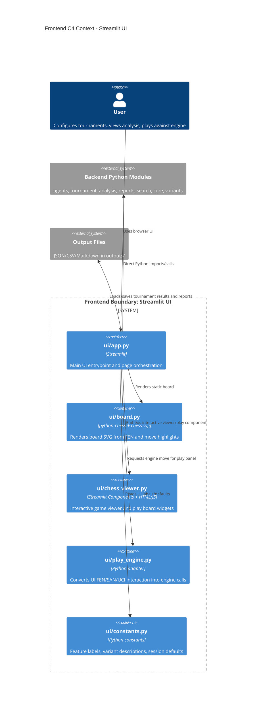

## 1.2 Frontend Component Diagram

```mermaid
flowchart TB
    subgraph UI["Frontend/UI package"]
        APP["ui/app.py<br/>main(), render panels, session state"]
        CONST["ui/constants.py<br/>ALL_FEATURES<br/>FEATURE_DISPLAY_NAMES<br/>SESSION_DEFAULTS<br/>VARIANT_DESCRIPTIONS"]
        BOARD["ui/board.py<br/>render_board()<br/>starting_fen()"]
        VIEWER["ui/chess_viewer.py<br/>chess_game_viewer()<br/>chess_play_interactive()<br/>chess_play_board()"]
        PLAY["ui/play_engine.py<br/>engine_reply()<br/>apply_san_move()<br/>game_status()"]
    end

    subgraph ImportedBackend["Direct backend imports used by ui/app.py"]
        FSA["agents.feature_subset_agent.FeatureSubsetAgent"]
        GEN["agents.generate_agents.generate_feature_subset_agents()"]
        RR["tournament.round_robin.run_round_robin()"]
        LB["tournament.leaderboard.compute_leaderboard()"]
        RIO["tournament.results_io<br/>load_results_json()<br/>save_results_json()"]
        FM["analysis.feature_marginals.compute_feature_marginals()"]
        SYN["analysis.synergy.compute_pairwise_synergies()"]
        INT["analysis.interpretation.generate_interpretation()"]
        REP["reports.markdown_report.generate_markdown_report()"]
        REG["features.registry.get_feature_names()"]
    end

    APP --> CONST
    APP --> BOARD
    APP --> VIEWER
    APP --> PLAY
    APP --> FSA
    APP --> GEN
    APP --> RR
    APP --> LB
    APP --> RIO
    APP --> FM
    APP --> SYN
    APP --> INT
    APP --> REP
    APP --> REG

    PLAY --> COREBOARD["core.board.Board.from_fen()"]
    PLAY --> FSA2["FeatureSubsetAgent"]
    PLAY --> ABE["search.alpha_beta.AlphaBetaEngine"]
    BOARD --> PYCHESS["python-chess / chess.svg"]
    VIEWER --> COMP["streamlit.components.v1.components.html()"]
```

## 1.3 Frontend Deployment Diagram

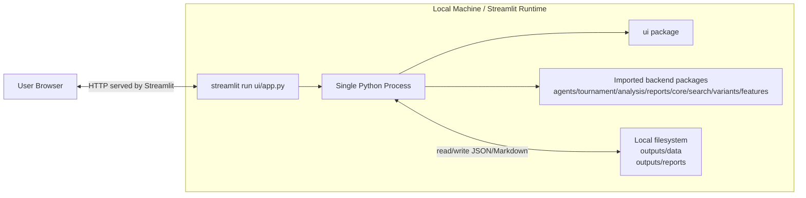

## 1.4 Frontend Sequence Diagram — Start Tournament from UI

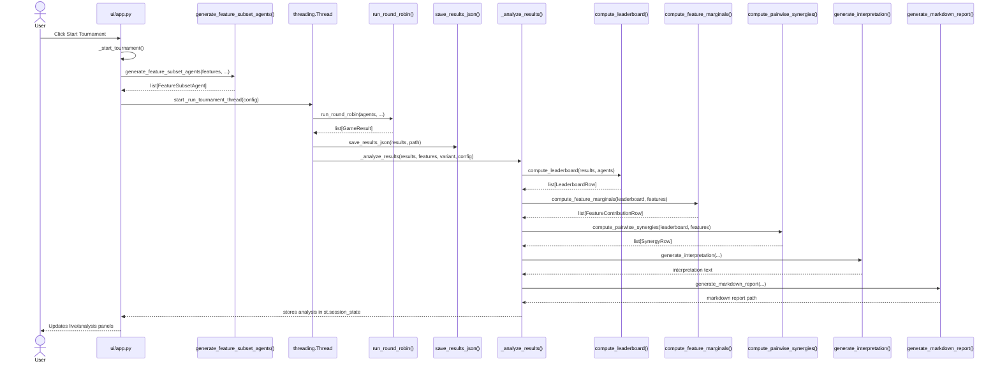

## 1.5 Frontend Data Flow Diagram

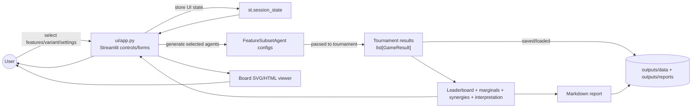

## 1.6 Frontend Package Diagram

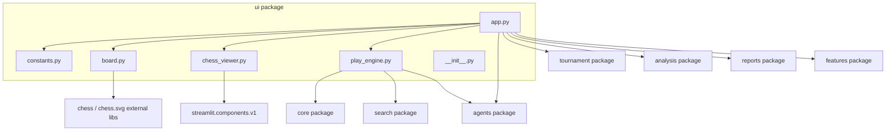

## 1.7 Frontend Class/Module Diagram

The UI package has no user-defined classes. This diagram maps actual UI modules and functions.

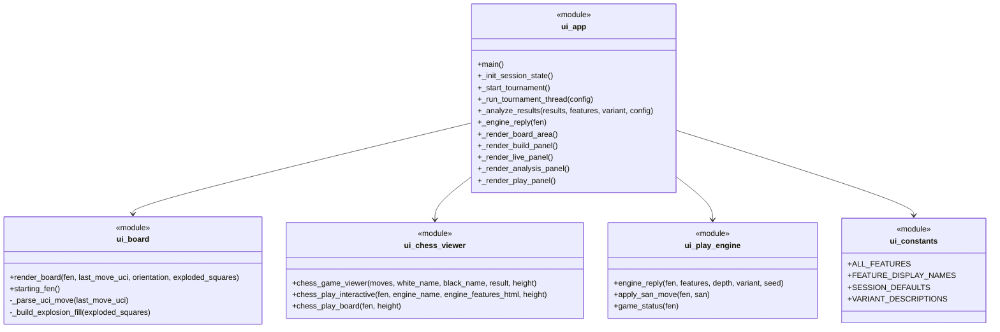

## 1.8 Frontend Activity Diagram — User Play Panel

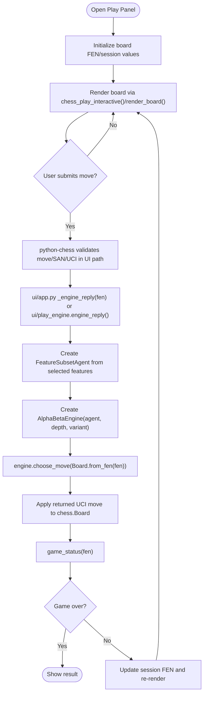

---

# 2. Backend Architecture — Engine, Simulation, Analysis, Reporting

## 2.1 Backend C4 Model

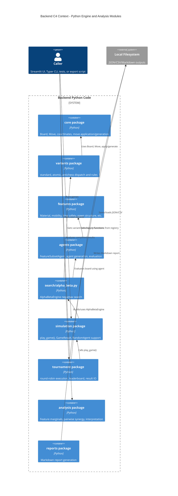

## 2.2 Backend Component Diagram

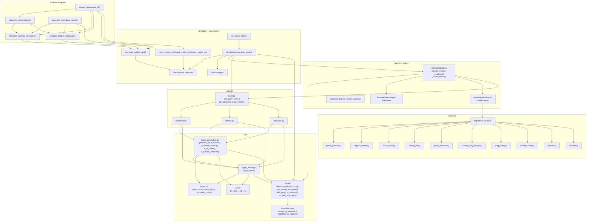

## 2.3 Backend Deployment Diagram

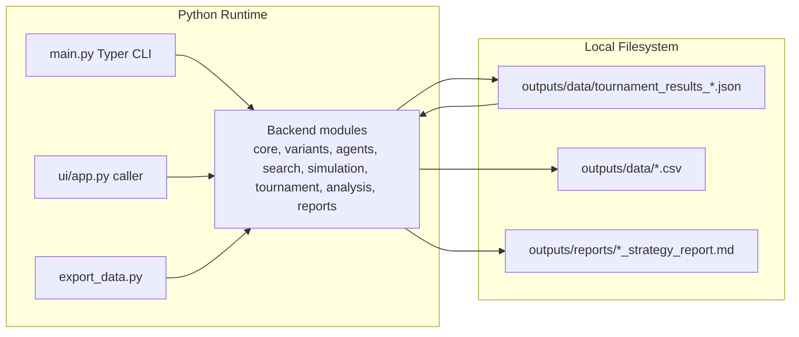

## 2.4 Backend Sequence Diagram — `play_game()`

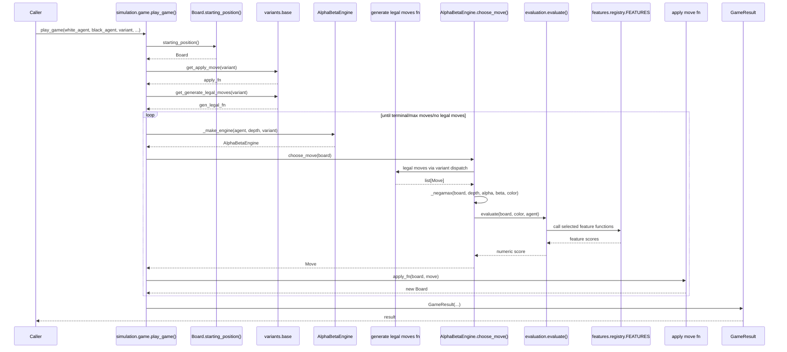

## 2.5 Backend Data Flow Diagram

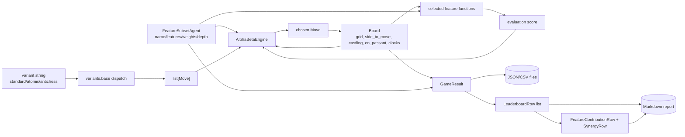

## 2.6 Backend Package Diagram

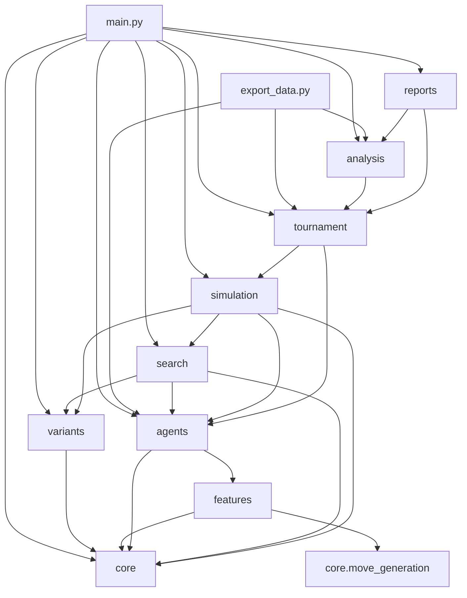

## 2.7 Backend Class Diagram

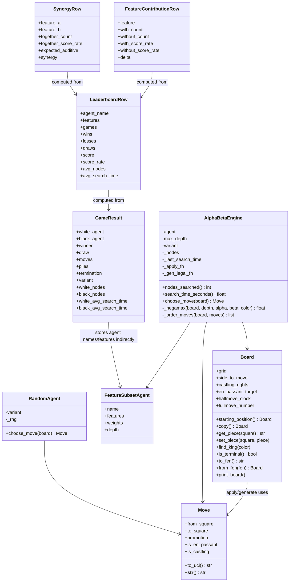

## 2.8 Backend Activity Diagram — Tournament + Analysis

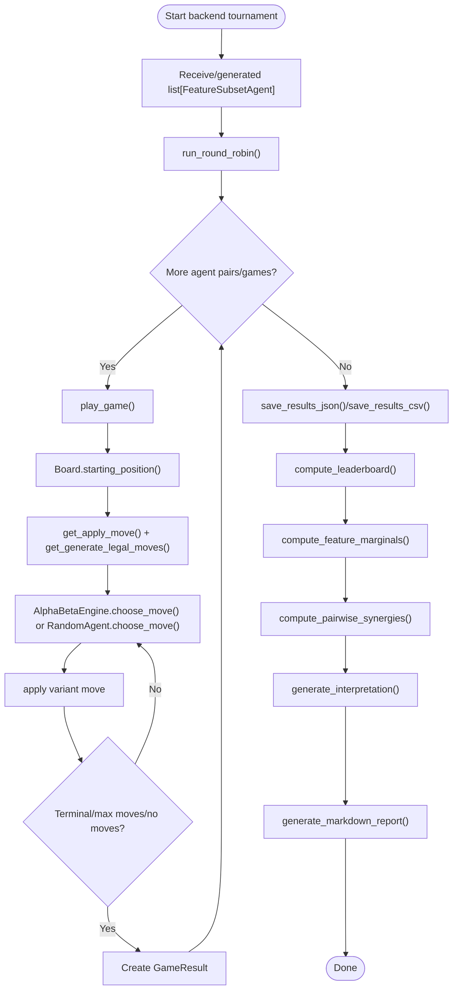

---

# 3. Whole Project Architecture — UI + CLI + Shared Backend + Files

## 3.1 Whole Project C4 Model

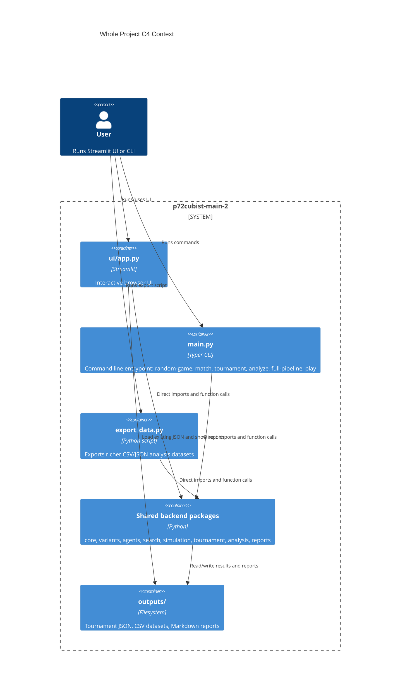

## 3.2 Whole Project Component Diagram

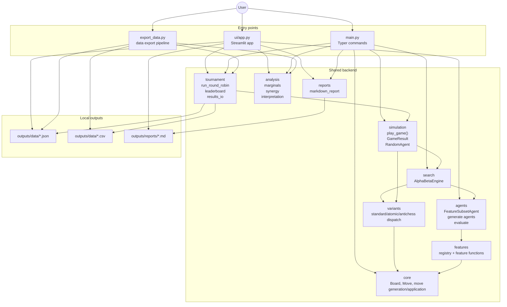

## 3.3 Whole Project Deployment Diagram

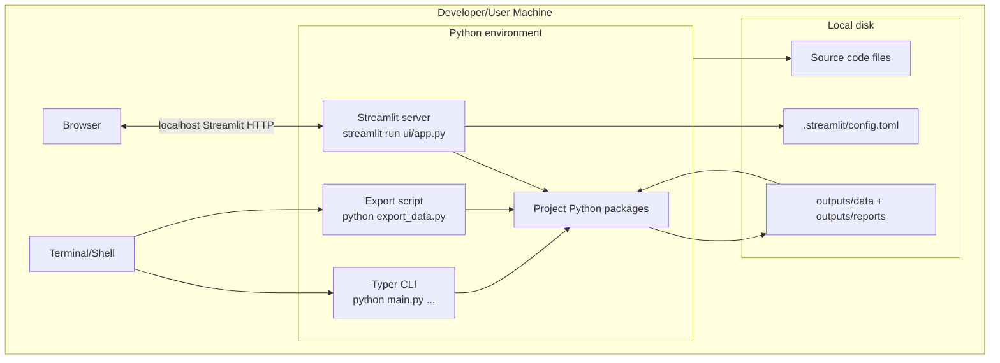

## 3.4 Whole Project Sequence Diagram — Full Pipeline via CLI

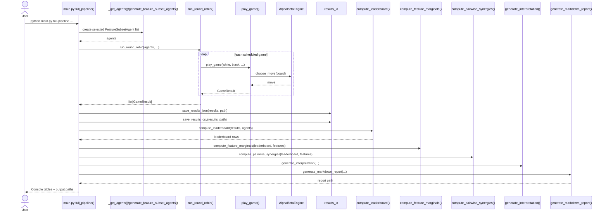

## 3.5 Whole Project Data Flow Diagram

```mermaid
flowchart LR
    UserInput["User input<br/>UI controls or CLI args"]
    AgentSelection["Feature list, agent count, depth, seed"]
    AgentObjects["FeatureSubsetAgent objects"]
    GameEngine["Simulation + AlphaBetaEngine"]
    RuleSystem["Variant dispatch + core chess rules"]
    FeatureEval["Feature evaluation registry"]
    Results["GameResult list"]
    JSON[(Tournament JSON)]
    CSV[(CSV exports)]
    Leaderboard["Leaderboard rows"]
    Analysis["Marginals + Synergies + Interpretation"]
    Markdown[(Markdown report)]
    UIOutput["Streamlit charts/tables/board"]
    CLIOutput["Rich console tables"]

    UserInput --> AgentSelection
    AgentSelection --> AgentObjects
    AgentObjects --> GameEngine
    RuleSystem --> GameEngine
    FeatureEval --> GameEngine
    GameEngine --> Results
    Results --> JSON
    Results --> CSV
    Results --> Leaderboard
    Leaderboard --> Analysis
    Analysis --> Markdown
    JSON --> UIOutput
    Leaderboard --> UIOutput
    Analysis --> UIOutput
    Leaderboard --> CLIOutput
    Analysis --> CLIOutput
```

## 3.6 Whole Project Package Diagram

```mermaid
flowchart TB
    root["project root"]

    root --> main_py["main.py"]
    root --> export_py["export_data.py"]
    root --> ui_pkg["ui"]
    root --> core_pkg["core"]
    root --> variants_pkg["variants"]
    root --> agents_pkg["agents"]
    root --> features_pkg["features"]
    root --> search_pkg["search"]
    root --> simulation_pkg["simulation"]
    root --> tournament_pkg["tournament"]
    root --> analysis_pkg["analysis"]
    root --> reports_pkg["reports"]
    root --> tests_pkg["tests"]
    root --> outputs_dir["outputs"]

    ui_pkg --> agents_pkg
    ui_pkg --> tournament_pkg
    ui_pkg --> analysis_pkg
    ui_pkg --> reports_pkg
    ui_pkg --> features_pkg
    ui_pkg --> search_pkg
    ui_pkg --> core_pkg

    main_py --> agents_pkg
    main_py --> simulation_pkg
    main_py --> tournament_pkg
    main_py --> analysis_pkg
    main_py --> reports_pkg
    main_py --> core_pkg
    main_py --> variants_pkg
    main_py --> search_pkg

    export_py --> tournament_pkg
    export_py --> analysis_pkg
    export_py --> agents_pkg

    simulation_pkg --> search_pkg
    simulation_pkg --> variants_pkg
    simulation_pkg --> core_pkg
    simulation_pkg --> agents_pkg

    search_pkg --> agents_pkg
    search_pkg --> variants_pkg
    search_pkg --> core_pkg

    agents_pkg --> features_pkg
    features_pkg --> core_pkg
    variants_pkg --> core_pkg
    tournament_pkg --> simulation_pkg
    analysis_pkg --> tournament_pkg
    reports_pkg --> tournament_pkg
    reports_pkg --> analysis_pkg

    tests_pkg --> core_pkg
    tests_pkg --> variants_pkg
    tests_pkg --> features_pkg
    tests_pkg --> agents_pkg
    tests_pkg --> search_pkg
    tests_pkg --> simulation_pkg
    tests_pkg --> tournament_pkg
    tests_pkg --> analysis_pkg
```

## 3.7 Whole Project Class Diagram

```mermaid
classDiagram
    class StreamlitUI {
        <<module ui/app.py>>
        +main()
        +_start_tournament()
        +_run_tournament_thread(config)
        +_analyze_results(results, features, variant, config)
    }

    class CLI {
        <<module main.py>>
        +random_game()
        +match()
        +tournament()
        +analyze()
        +full_pipeline()
        +play()
    }

    class Board {
        +starting_position() Board
        +copy() Board
        +get_piece(square)
        +set_piece(square,piece)
        +find_king(color)
        +is_terminal()
        +to_fen()
        +from_fen(fen)
    }

    class Move {
        +from_square
        +to_square
        +promotion
        +is_en_passant
        +is_castling
        +to_uci()
    }

    class FeatureSubsetAgent {
        +name
        +features
        +weights
        +depth
    }

    class AlphaBetaEngine {
        +choose_move(board)
        -_negamax(board, depth, alpha, beta, color)
        -_order_moves(board, moves)
    }

    class RandomAgent {
        +choose_move(board)
    }

    class GameResult {
        +white_agent
        +black_agent
        +winner
        +draw
        +moves
        +plies
        +termination
        +variant
    }

    class LeaderboardRow {
        +agent_name
        +features
        +games
        +wins
        +losses
        +draws
        +score
        +score_rate
    }

    class FeatureContributionRow {
        +feature
        +delta
    }

    class SynergyRow {
        +feature_a
        +feature_b
        +synergy
    }

    StreamlitUI --> FeatureSubsetAgent
    StreamlitUI --> GameResult
    StreamlitUI --> LeaderboardRow
    CLI --> FeatureSubsetAgent
    CLI --> GameResult
    CLI --> LeaderboardRow
    AlphaBetaEngine --> FeatureSubsetAgent
    AlphaBetaEngine --> Board
    AlphaBetaEngine --> Move
    RandomAgent --> Board
    RandomAgent --> Move
    GameResult --> Move : stores UCI move strings
    LeaderboardRow --> GameResult : computed from
    FeatureContributionRow --> LeaderboardRow : computed from
    SynergyRow --> LeaderboardRow : computed from
```

## 3.8 Whole Project Activity Diagram

```mermaid
flowchart TD
    Start([User starts project])
    Entry{"Entry point?"}

    UIStart["Streamlit UI: ui/app.py main()"]
    CLIStart["CLI: main.py command"]
    ExportStart["Export: export_data.py export_all()"]

    Configure["Choose variant/features/agents/depth/games/seed"]
    GenerateAgents["generate_feature_subset_agents() or _get_agents()"]
    RunTournament{"Tournament/match/play?"}
    SingleGame["simulation.game.play_game()"]
    RoundRobin["tournament.round_robin.run_round_robin()"]
    Interactive["main.py play() or UI play panel"]

    Analyze{"Analyze results?"}
    SaveResults["results_io save/load JSON/CSV"]
    Leaderboard["compute_leaderboard()"]
    Marginals["compute_feature_marginals()"]
    Synergy["compute_pairwise_synergies()"]
    Interpret["generate_interpretation()"]
    Report["generate_markdown_report()"]
    Render["Render UI tables/charts/board or CLI Rich tables"]
    Done([Done])

    Start --> Entry
    Entry -- UI --> UIStart --> Configure
    Entry -- CLI --> CLIStart --> Configure
    Entry -- Export existing results --> ExportStart --> SaveResults

    Configure --> GenerateAgents --> RunTournament
    RunTournament -- single/match/play_game --> SingleGame
    RunTournament -- round robin --> RoundRobin
    RunTournament -- interactive play --> Interactive

    SingleGame --> SaveResults
    RoundRobin --> SaveResults
    Interactive --> Render

    SaveResults --> Analyze
    Analyze -- yes --> Leaderboard --> Marginals --> Synergy --> Interpret --> Report --> Render --> Done
    Analyze -- no --> Render --> Done
```

---

# Code-Trace Notes Used for the Diagrams

## Real entry points

```mermaid
flowchart LR
    UI["ui/app.py main()"]
    CLI["main.py Typer app commands"]
    Export["export_data.py export_all()"]

    UI --> Backend["Shared Python backend modules"]
    CLI --> Backend
    Export --> Backend
```

## Real backend move-search path

```mermaid
flowchart TD
    A["AlphaBetaEngine.choose_move(board)"]
    B["variant generate legal moves fn<br/>from get_generate_legal_moves(variant)"]
    C["_order_moves(board, legal_moves)"]
    D["_negamax(board, depth, alpha, beta, color)"]
    E["variant apply move fn<br/>from get_apply_move(variant)"]
    F["evaluation.evaluate(board, color, agent)"]
    G["features.registry.FEATURES"]
    H["selected feature functions"]

    A --> B --> C --> D
    D --> E
    D --> F --> G --> H
```

## Real tournament-analysis-report path

```mermaid
flowchart TD
    A["run_round_robin(agents, ...)"]
    B["play_game(...)"]
    C["list[GameResult]"]
    D["save_results_json()/save_results_csv()"]
    E["compute_leaderboard()"]
    F["compute_feature_marginals()"]
    G["compute_pairwise_synergies()"]
    H["generate_interpretation()"]
    I["generate_markdown_report()"]

    A --> B --> C --> D --> E --> F --> G --> H --> I
```
